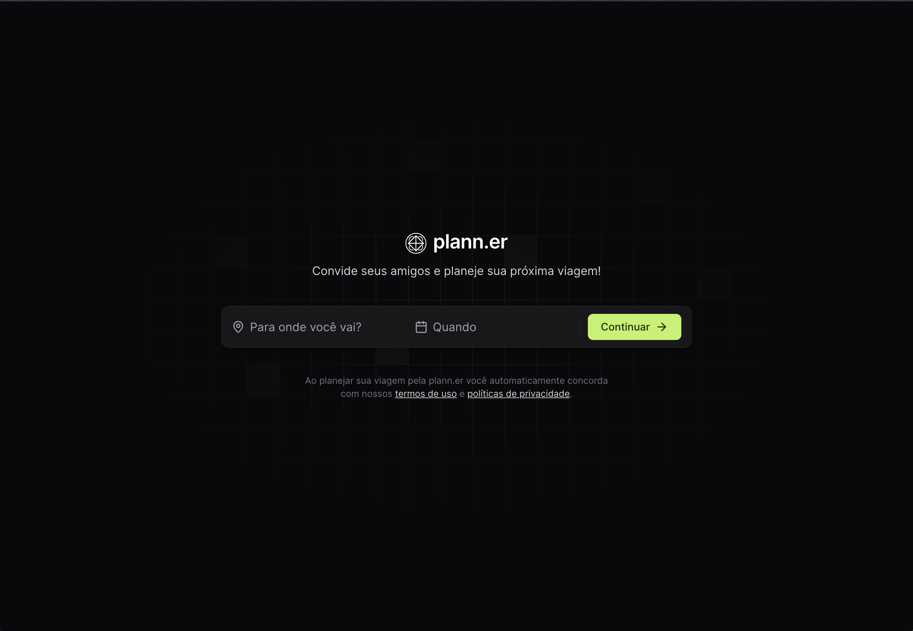
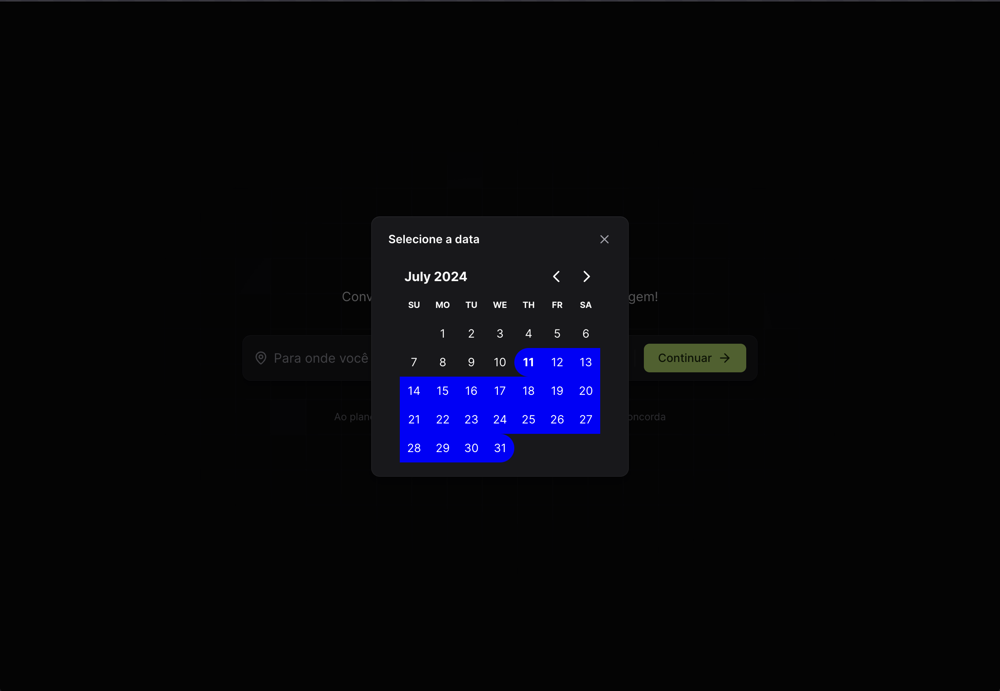
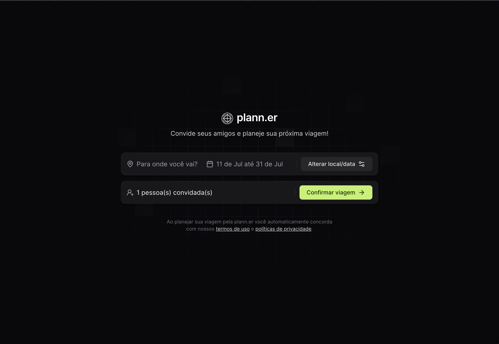
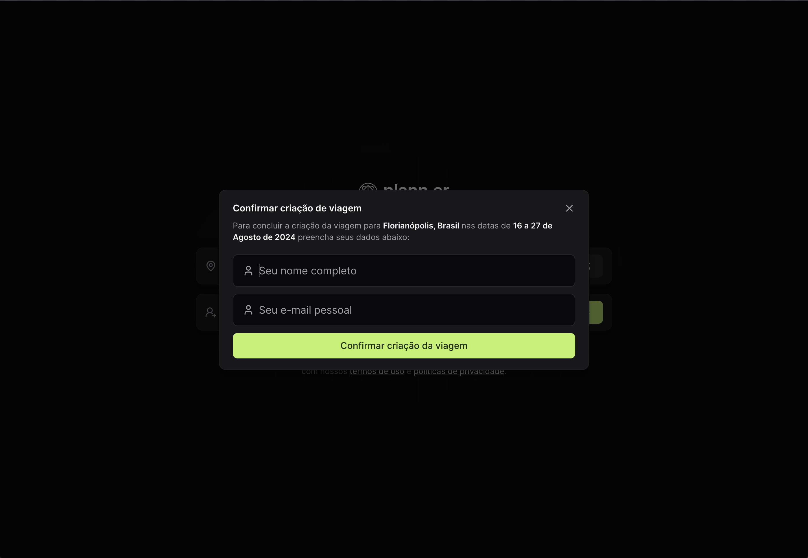

# Plann.er

## Overview

This project is designed to plan trips with friends and family. It utilizes Figma for the design, TypeScript and ReactJs with Vite to achieve its objectives, providing a robust solution that is both scalable and efficient.

## Features

- Destination: Plan trip to specific destination.
- Start date & End date: Select specific date to start and end.
- Share via e-mail: Share the invite with friends and family.

## Getting Started

To get started with this project, follow these steps:

1. Clone the repository to your local machine.
2. Navigate to the project directory.
3. Install the required dependencies:

   ```bash
   npm install
   ```

   ```bash
   npm run dev
   ```

   
   
   
   

Made with 💙 by [Nicolas Ian Bizotto](https://www.linkedin.com/in/nicolas-bizotto/)
